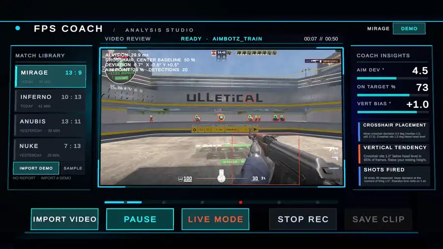

# FPS AI Coach

Offline practice review for CS2. You record a session with OBS, the backend runs
CUDA YOLO over the recording after the fact, and the Unity war room plays the
video back with detection overlays and a session-level aim report.



Red outlines are body boxes, green are heads the detector found, and the amber
ring marks where the crosshair should have been. The rail on the right is the
session report, filled from the run in progress. Full-resolution clip:
[`docs/assets/war-room.mp4`](docs/assets/war-room.mp4).

Analysis is deliberately not real time. It runs after the round, so the game and
inference never contend for the GPU, and because a coaching cue delivered
mid-duel is both too late to act on and impossible to read while playing.

**GPU gaming PC (the machine that should run the full stack):** after `git
clone` / `git pull`, follow `AGENTS.md`. First-time vision setup is
`.\Backend\setup-vision.ps1`, then `.\Backend\run-vision.ps1`. Do not run
`.\Backend\run.ps1` before that on a CUDA machine: it installs CPU torch.

## Requirements

- Unity 6.2 (`6000.2.15f1`)
- Python 3.10 or 3.11
- Windows 10 or Windows 11
- An NVIDIA GPU with a working driver, plus OBS for recording

## Practice review

1. Record a session with OBS at 1080p60 **with an audio track**. The output
   directory must sit inside `FPS_VISION_MEDIA_ROOT` (`media\` by default),
   otherwise `POST /api/v1/vision/video` returns 400.
2. Start the backend with `.\Backend\run-vision.ps1`.
3. Open `UnityClient`, load `Assets/Scenes/Main.unity`, press Play.
4. Select `IMPORT VIDEO` and pick the recording.

Overlays stream in as frames are analysed rather than appearing only at the end.
When the job finishes, the right rail switches to the aim report.

### What gets measured

Everything is reported in degrees rather than pixels, so numbers stay comparable
across resolutions and recordings. The conversion is non-linear and needs the
FOV the footage was recorded at; set it in `.env` or per request.

Per session:

- Crosshair placement deviation: mean, median, p90, and a histogram
- Vertical tendency, signed. A positive bias means aiming below head level,
  which is the most common fault at low ranks
- Horizontal tendency, signed
- Effective tracking: the share of the time a head was visible during which the
  crosshair stayed within the threshold

Per shot, when the recording has audio:

- Deviation at the instant of firing
- Reaction time, measured once per engagement rather than per round fired
- Overcorrection, meaning the crosshair crossed the target and swung back

A figure that rests on too few samples is labelled as such instead of being
quoted. On an aim trainer the bots never leave the screen, so the whole clip is
one engagement and the reaction time is a single measurement, not a mean.

## How the numbers are checked

A registered headshot kill is its own label. The server confirmed the bullet
passed through a head hitbox, so at that tick the crosshair was on a head to
within the head's own angular radius, about 0.25° at typical range. `player_death`
parses out of a plain POV demo, which makes ground truth available with no manual
labelling and no need for entity coordinates.

Measured against 44 server-confirmed headshots on range footage:

| Target selection | Median error at the shot | Above 5° |
| --- | --- | --- |
| Detected head boxes only | 2.48° | 34% |
| Head placed from the body box | 0.36° | 7% |

That comparison is why a body box counts as a target. At range the detector boxes
a player but not their roughly 10 px head, so ranking head boxes alone kept
picking a nearer bot far off-axis and reporting its angle instead.

Pairing a recording with its demo needs no clapperboard. Audio onsets found 56 of
the demo's 57 fire events and the offset estimator matched 89% of them, with a
residual of 5.7 ms standard deviation and no bias — a third of a frame at 60 fps.

The Unity client is verified the same way rather than by eye. A scripted pass
drives the Editor over the Unity CLI: it loads a recording, waits out the job,
jumps forwards, backwards and back to a position already visited, and checks that
the frame on screen is the one the overlay is drawing. See `AGENTS.md` for how to
run it.

## API

```text
GET    /health
POST   /api/v1/vision/frame
POST   /api/v1/vision/video
GET    /api/v1/vision/jobs/{job_id}?results_from=&limit=
GET    /api/v1/vision/recordings
GET    /api/v1/vision/sessions
GET    /api/v1/vision/sessions/{job_id}/metrics
GET    /api/v1/vision/sessions/{job_id}/frames
DELETE /api/v1/vision/sessions/{job_id}
POST   /api/v1/analyze/demo
GET    /api/v1/analyze/demo/sample
```

`results_from` opts into progressive delivery: it returns the frames analysed so
far instead of waiting for the job. Sessions are written to `data/` as JSON, so
they survive a restart and two practice rounds can be compared.

Check `GET /health` for `vision.cuda_available`, `vision.enemy_model` and
`vision.shot_detection`.

## Configuration

Repo-root `.env`, see `.env.example`:

| Key | Meaning |
| --- | --- |
| `FPS_VISION_ENEMY_MODEL_PATH` | Enemy detection weights |
| `FPS_VISION_DEVICE` | `cuda` on the gaming PC |
| `FPS_VISION_IMGSZ` | Inference resolution. Leave empty; the default follows the footage |
| `FPS_VISION_FOV_DEG` | In-game FOV, horizontal at 4:3. Default 90 |
| `FPS_VISION_MEDIA_ROOT` | Where OBS writes, and the only place videos may be read from |
| `FPS_VISION_DATA_ROOT` | Where analysed sessions are stored |
| `FPS_VISION_JOB_TTL_SECONDS` | How long finished jobs stay in memory |

Two settings are easy to get wrong in ways that look like a broken model rather
than a misconfiguration.

`FPS_VISION_IMGSZ` should stay empty. Ultralytics defaults to 640, and
letterboxing a 1080p frame to that leaves a head at range about 3 px across,
under the 8 px stride of the network's finest feature map, so heads stop being
detected. On 88 seconds of range footage, 640 found a head on 14.4% of players it
had already boxed, against 65.6% at native resolution, and was no faster: video
decode dominates, not inference. The same recording reported a median crosshair
deviation of 38.4 deg at 640 and 1.5 deg at native.

`sample_rate` should be 8 or more if you want shot metrics. Shots align to a
frame only within 0.12 s, so at 2 fps most of them fall between samples, and
overcorrection detection needs at least two samples inside a 0.35 s window.

## Demo analysis

CS2 `.dem` files are parsed for kills, deaths, assists, K/D, headshot rate,
damage, ADR and opening duels.

```text
POST http://127.0.0.1:8000/api/v1/analyze/demo
```

Uploaded demos are parsed from a temporary file that is removed once the request
completes.

## Measuring detector accuracy

Recording a range session with OBS and the console `record` command at the same
time makes the demo a source of ground truth: it knows exactly where every
target was, so projecting those positions into the recording produces head boxes
with no manual labelling.

```powershell
python Backend\tools\pair_demo_video.py `
  --demo media\range.dem --session <job_id> --player "YourName" `
  --output reports\range-accuracy.json
```

The video and the demo start at unrelated moments. Rather than asking for the
lag, the tool recovers it by matching audio gunshot onsets against the demo's
fire events, and reports how confident that alignment is. A low alignment score
means the accuracy figures should not be quoted.

To compare candidate weights on identical footage:

```powershell
python Backend\tools\compare_accuracy.py `
  --video media\range.mp4 --demo media\range.dem --player "YourName" `
  --model baseline=models\yolov8m-csgo.pt `
  --model finetuned=models\yolov8m-cs2.pt `
  --output reports\baseline-comparison.json
```

## Live view

`Live Mode` in the Unity header shows an OBS Virtual Camera feed on the tactical
screen. It is display only; there is no live analysis.

## Build the Windows client

The project uses the Mono scripting backend so Windows builds do not require the
optional IL2CPP module.

```powershell
.\build-windows.ps1
```

Output is `Builds/Windows/FPS-AI-Coach-Live.exe`. The same build is available
from `FPS AI Coach > Build Windows MVP` in Unity. In-editor clip recording is
unavailable in player builds, because Unity's encoder is an editor-only API;
record with OBS instead, which is what the analysis pipeline consumes anyway.

## Tests

```powershell
cd Backend
.\.venv\Scripts\python.exe -m unittest discover -s tests -t .
```

97 tests, a couple of seconds. Anything that feeds a reported number lives in a
module rather than a CLI so that it can be covered: `geometry`, `metrics`,
`projection`, `evaluation` and `shot_detector` are all pure.

## Out of scope for now

LLM coaching, a database, a Vue front end, Valorant support, cross-machine
upload, and a 2D or 3D demo replay view. The video endpoint takes a local path
that must resolve inside `FPS_VISION_MEDIA_ROOT`; it is not an upload endpoint.

Agent onboarding for the GPU runtime machine is `AGENTS.md`. Longer Chinese
design notes and runbooks are kept in an untracked local `doc/` folder.
